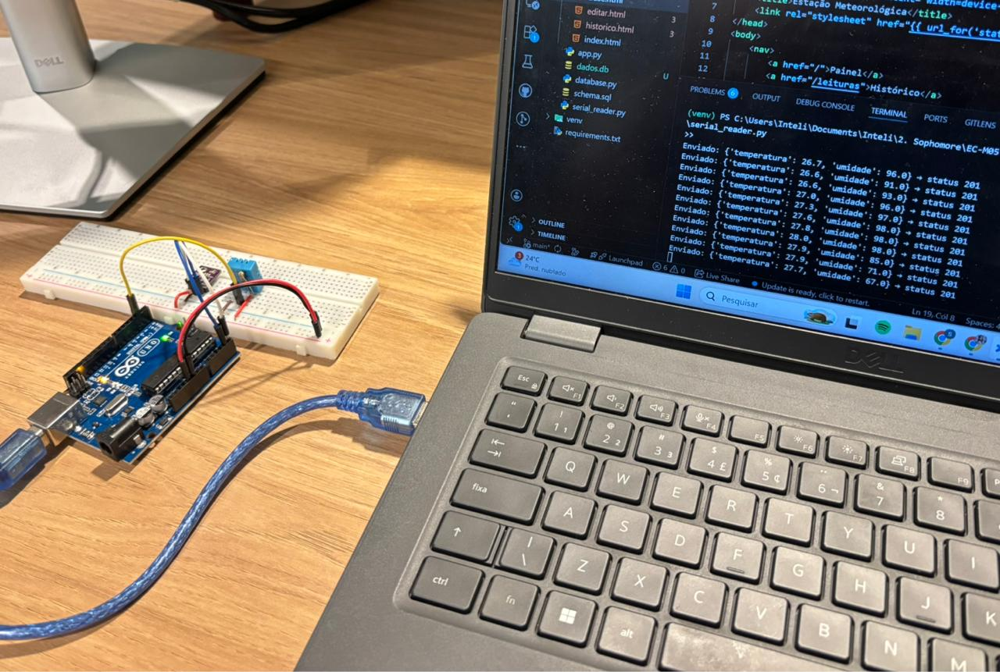
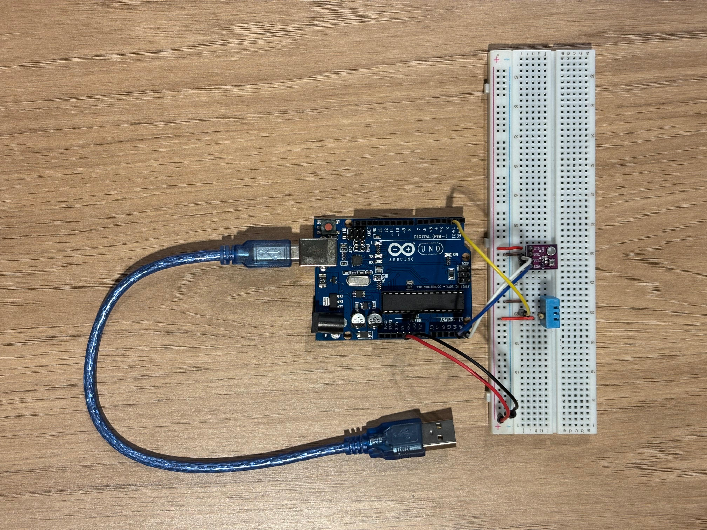
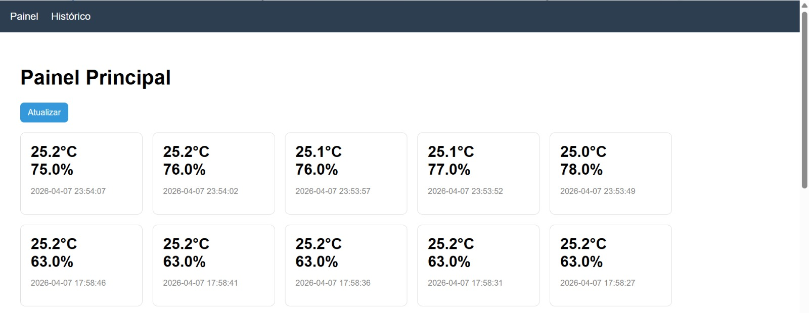
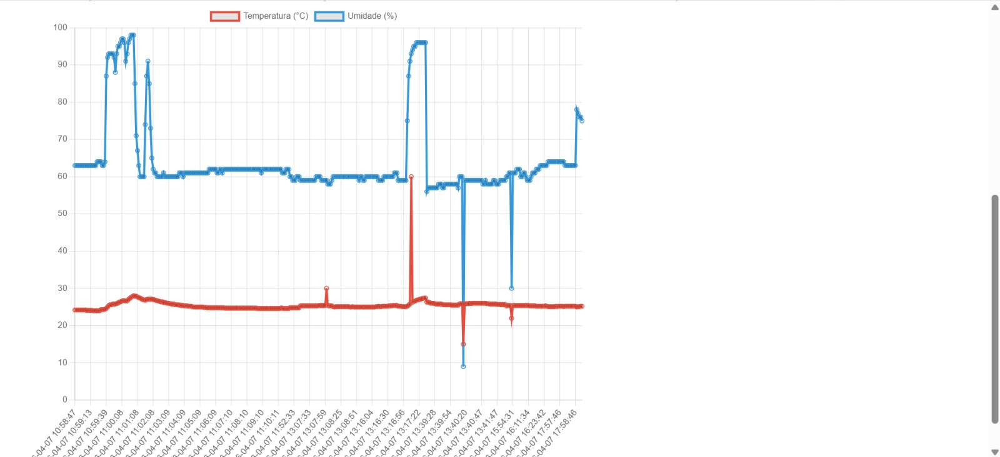
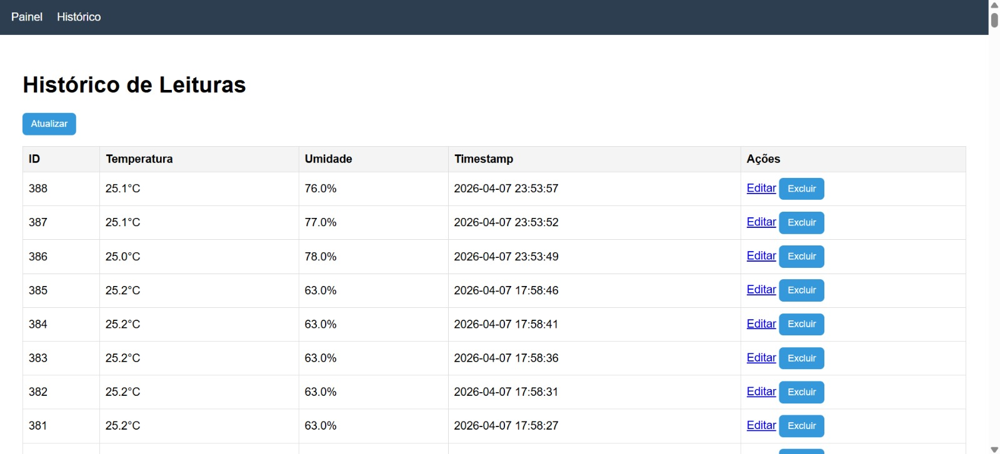
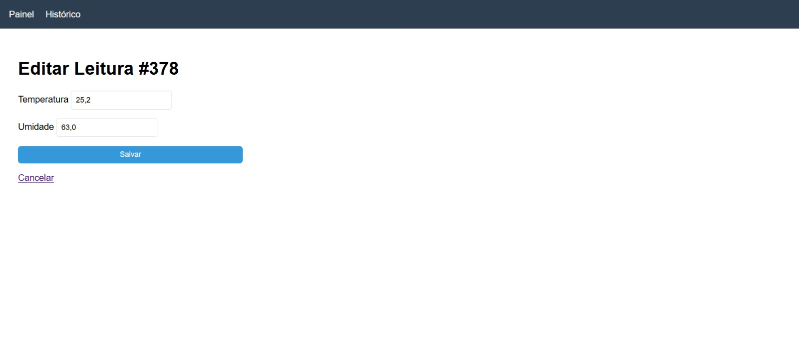

# Sistema de Medição de Estação Meteorológica IoT

Sistema completo de IoT para monitoramento de temperatura e umidade, integrando hardware físico, comunicação serial, API REST, banco de dados relacional e interface web.



## 1. Apresentação

O sistema coleta dados de temperatura e umidade por meio de sensores físicos conectados a um Arduino Uno, transmite essas informações via comunicação serial USB para um servidor Python com Flask, persiste os dados em um banco SQLite e os disponibiliza em uma interface web com visualização gráfica e operações de gerenciamento.

O objetivo é construir um pipeline funcional de ponta a ponta, desde o dado bruto do sensor até a visualização na interface.

## 2. Visão Geral da Arquitetura

O sistema segue a arquitetura proposta no enunciado, sem modificações estruturais:

```
Arduino → Serial USB → serial_reader.py → API Flask → SQLite → Interface Web
```

| Camada | Tecnologia | Responsabilidade |
|--------|-----------|-----------------|
| Hardware | Arduino Uno + DHT11 | Leitura e envio de dados via serial |
| Backend | Python + Flask + SQLite | Receber, armazenar e expor via API REST |
| Frontend | HTML + CSS + JS + Jinja2 | Exibir e gerenciar leituras |

### Decisões de arquitetura

**Banco de dados com WAL:** como o Flask e o `serial_reader.py` escrevem no banco simultaneamente, foi ativado o modo WAL (Write-Ahead Logging) no SQLite. Isso evita o erro `database is locked`, permitindo que os dois processos coexistam sem travar a aplicação.

**Processos separados:** a leitura serial e o servidor Flask rodam em terminais independentes, pois o `readline()` do PySerial é bloqueante e travaria o Flask se rodassem no mesmo processo sem estratégia de concorrência.

**Atualização da interface:** inicialmente foi implementada atualização automática via `setInterval` com `location.reload()`. Porém, isso causava dois problemas: perda de dados digitados durante edição de leituras e dependência do backend estar ativo para não quebrar a página. Como alternativa, foi decidio substituir a atualização automática pela manual por meio da implementação de um botão (atualizar), dando ao usuário controle sobre quando recarregar os dados.

## 3. Estrutura do Projeto

```
estacao_meteorologica/
├── src/
│   ├── app.py              # Aplicação Flask e endpoints
│   ├── database.py         # Funções de acesso ao SQLite
│   ├── serial_reader.py    # Leitura serial e envio à API
│   ├── schema.sql          # Criação do banco
│   ├── dados.db            # Banco com leituras reais
│   ├── static/
│   │   ├── css/style.css
│   │   └── js/main.js
│   ├── templates/
│   │   ├── base.html
│   │   ├── index.html
│   │   ├── historico.html
│   │   └── editar.html
│   └── arduino/
│       └── estacao.ino
└── README.md
```

## 4. Hardware e Circuito

Para a montagem do IoT, foi utilizado o Arduino Uno que atua como o dispositivo de borda do sistema, responsável por ler os sensores físicos e transmitir os dados no formato JSON pela porta serial a cada 5 segundos. Esse intervalo foi escolhido para garantir um volume de dados representativo sem sobrecarregar o banco ou a API.



### Componentes utilizados

- Arduino Uno
- Sensor DHT11 (temperatura e umidade)
- Resistor pull-up de 10kΩ
- Protoboard e 5 jumpers

### Conexões

| DHT11 | Destino |
|-------|---------|
| Pino 1 (VCC) | Trilho + da protoboard → Arduino 5V |
| Pino 2 (DATA) | Pino digital 2 do Arduino + resistor pull-up para VCC |
| Pino 4 (GND) | Trilho – da protoboard → Arduino GND |

### Sensor de pressão (BME280) — tentativa de integração

Foi realizada a tentativa de integração de um sensor BME280 para coleta de pressão atmosférica. O processo envolveu:

1. **Identificação do erro inicial:** o sensor foi inicialmente tratado como BMP280, mas era um BME280, o que gerava falha na leitura por uso da biblioteca incorreta.
2. **Correção da biblioteca:** substituição de `Adafruit_BMP280` por `Adafruit_BME280` e ajuste de todos os objetos e chamadas no código.
3. **Testes de endereço I2C:** foram testados os endereços `0x76` e `0x77`.
4. **Scanner I2C:** foi executado um sketch de varredura I2C que confirmou que o primeiro sensor não respondia em nenhum endereço, indicando defeito de hardware.
5. **Substituição física:** o sensor foi trocado. O scanner identificou o novo sensor em `0x76`, porém o novo hardware introduziu instabilidade que afetava inclusive a leitura do DHT11, impedindo o funcionamento conjunto dos dois sensores.

**Decisão final:** diante dos erros identificados e corrigidos ao longo do processo, optou-se por manter o sistema operando apenas com o DHT11, garantindo estabilidade na coleta de dados. O sistema foi projetado de forma que o campo `pressao` existe no banco e, caso o sensor esteja disponível (`bmp_ok = true`), a pressão é incluída automaticamente no JSON sem qualquer alteração no restante do sistema.

**Resultado:** o hardware principal opera de forma estável, com os dados de temperatura e umidade sendo coletados e persistidos corretamente.

## 5. Banco de Dados

O banco de dados relacional é responsável por persistir todas as leituras recebidas pelo servidor. Foi utilizado o SQLite por ser um banco embutido, sem necessidade de servidor separado, o que o torna ideal para projetos de prototipagem e IoT. Toda a interação com o banco é feita pelo módulo `database.py`, que encapsula as operações e é importado pelo Flask.

### Schema

O schema define a estrutura da tabela principal do sistema:

```sql
CREATE TABLE IF NOT EXISTS leituras (
    id          INTEGER PRIMARY KEY AUTOINCREMENT,
    temperatura REAL NOT NULL,
    umidade     REAL NOT NULL,
    pressao     REAL,
    localizacao TEXT DEFAULT 'Lab',
    timestamp   DATETIME DEFAULT (datetime('now','localtime'))
);
```

> O script completo de criação está em [`src/schema.sql`](src/schema.sql).

### Funções implementadas

Cada função foi implementada de forma independente e testável, separando responsabilidades e facilitando manutenção:

| Função | Operação |
|--------|----------|
| `get_db_connection()` | Conexão com WAL e `row_factory` para acesso por nome de coluna |
| `init_db()` | Criação das tabelas via `schema.sql` |
| `inserir_leitura()` | INSERT com suporte a pressão opcional |
| `listar_leituras()` | SELECT com limite configurável |
| `buscar_leitura(id)` | SELECT por ID |
| `atualizar_leitura(id, dados)` | UPDATE |
| `deletar_leitura(id)` | DELETE |
| `estatisticas()` | AVG, MIN, MAX de temperatura e umidade |

**Resultado:** o banco conta com mais de 300 leituras reais coletadas durante os testes do sistema, confirmando a persistência contínua e estável dos dados ao longo das sessões.

## 6. API REST

A API é o ponto central do sistema: ela recebe os dados do Arduino (via `serial_reader.py`), os persiste no banco e os disponibiliza para a interface web. Foi construída com Flask, um microframework Python que permite definir rotas de forma simples e modular. Cada rota corresponde a uma operação específica sobre os dados de leituras, seguindo os princípios REST, na qual o método HTTP indica a intenção da operação.

Todos os endpoints respondem em HTML por padrão ou em JSON quando o parâmetro `?formato=json` é informado.

| Método | Rota | Descrição |
|--------|------|-----------|
| GET | `/` | Painel com últimas 10 leituras |
| GET | `/leituras` | Histórico completo |
| GET | `/leituras?formato=json` | Histórico em JSON |
| POST | `/leituras` | Cria nova leitura |
| GET | `/leituras/<id>` | Formulário de edição |
| PUT | `/leituras/<id>` | Atualiza uma leitura |
| DELETE | `/leituras/<id>` | Remove uma leitura |
| GET | `/api/estatisticas` | Média, mín e máx do período |

**Resultado:** todos os endpoints foram validados e respondem corretamente. O fluxo completo, do POST gerado pelo `serial_reader.py` até o dado disponível via GET na interface, funciona de forma estável, com o código HTTP 201 confirmando cada inserção bem-sucedida.

## 7. Leitura Serial

O `serial_reader.py` é o elo entre o hardware e o backend. Ele roda como um processo independente do Flask, lendo continuamente a porta serial onde o Arduino está conectado e encaminhando cada leitura para a API via requisição HTTP POST. A separação em processo independente é necessária porque a leitura serial é bloqueante (o programa fica parado aguardando dados), o que travaria o servidor Flask se rodassem juntos.

O script realiza:

- Conexão com o Arduino via `serial.Serial` na porta configurada (COM5)
- Leitura linha a linha com `readline()`, usando `\n` como delimitador
- Conversão do texto recebido em dicionário Python com `json.loads()`
- Envio à API via `requests.post()`
- Tratamento de linhas corrompidas (fragmentação de buffer serial) com `json.JSONDecodeError`
- Tratamento de falha de conexão com `serial.SerialException`

**Resultado:** a comunicação serial opera de forma estável. Linhas inválidas decorrentes de fragmentação de buffer são ignoradas automaticamente, sem interromper o fluxo de coleta. O sistema demonstrou robustez ao longo de sessões contínuas de coleta.

## 8. Interface Web

A interface foi construída com HTML, CSS e JavaScript, usando o sistema de templates Jinja2 do Flask para renderização server-side. A herança de templates (`base.html`) elimina duplicação de código: o menu, os estilos e os scripts são definidos uma única vez e herdados por todas as páginas. O gráfico de variação temporal foi implementado com Chart.js, consumindo dados do endpoint `/leituras?formato=json`.

Cada página conta com um botão de atualização manual, permitindo ao usuário recarregar os dados sob demanda, sem risco de perda de input durante edição e sem dependência de o backend estar continuamente ativo.

### Painel Principal

A tela principal exibe as últimas 10 leituras em cards individuais, com temperatura, umidade e timestamp de cada registro.



Abaixo dos cards, um gráfico de linha mostra a variação temporal de temperatura e umidade ao longo das leituras mais recentes.




### Histórico (`/leituras`)

A tela de histórico exibe todas as leituras armazenadas no banco em formato de tabela, com as colunas de ID, temperatura, umidade, timestamp e ações disponíveis. Cada linha possui botões de edição e exclusão, permitindo o gerenciamento direto dos registros.



> Para simplificação, todas as leituras são carregadas na interface. Em cenários com maior volume de dados, seria recomendável implementar paginação ou limite de registros.


### Edição (`/leituras/<id>`)

A tela de edição exibe um formulário pré-preenchido com os dados da leitura selecionada, permitindo corrigir valores de temperatura e umidade. A submissão é feita via requisição PUT ao endpoint correspondente, sem recarregamento completo da página.



**Resultado:** as três páginas funcionam de forma integrada. O fluxo de visualização, edição e exclusão de registros foi validado, com as operações refletindo corretamente no banco de dados e na interface após atualização.

## 9. Como Executar

### Pré-requisitos

- Python 3.10+
- Arduino IDE com biblioteca DHT (Adafruit)
- Arduino Uno com DHT11 conectado

### Instalação

```bash
# Na raiz do projeto
python -m venv venv
venv\Scripts\activate       # Windows
pip install flask pyserial requests
```

### Execução

Abra dois terminais na raiz do projeto, com o venv ativado em ambos.

**Terminal 1 — servidor Flask:**
```bash
python src/app.py
```

**Terminal 2 — leitura serial:**
```bash
python src/serial_reader.py
```

Acesse no navegador: `http://localhost:5000`

> **Atenção:** o Monitor Serial do Arduino IDE deve estar fechado antes de rodar o `serial_reader.py`, pois ambos disputam a mesma porta COM.

## 10. Referências

- [Flask](https://flask.palletsprojects.com)
- [PySerial](https://pyserial.readthedocs.io)
- [SQLite com Python](https://docs.python.org/3/library/sqlite3.html)
- [DHT sensor library (Adafruit)](https://github.com/adafruit/DHT-sensor-library)
- [Chart.js](https://www.chartjs.org)